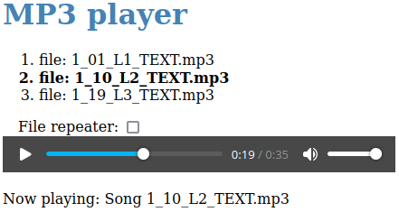

# Generated music player

Listening to music, language courses, or other audio files?
Then you might find a simple audio file player that is generated into an HTML file with your playlist.
It has the advantage of easy portability between different operating systems (including Android) and can be uploaded to a web server naturally.

To create the player, you will need Java 17+ and a script written in Java that runs (without prior compilation) in the music files directory (with the MP3 extension)
by the command: `java Mp3PlayerGenerator.java`. 
The player is generated in the `index.html` file.
Operation is simple: open the file in your favorite HTML5 and Javascript-enabled web browser.
You can then use the mouse to select the file to play and the space bar to pause or restart the playback.
The playlist plays over and over again.

## Screenshot:

## More information:

* License: Apache License, Version 2.0
* Homepage: https://github.com/pponec/Mp3PlayerGenerator/

